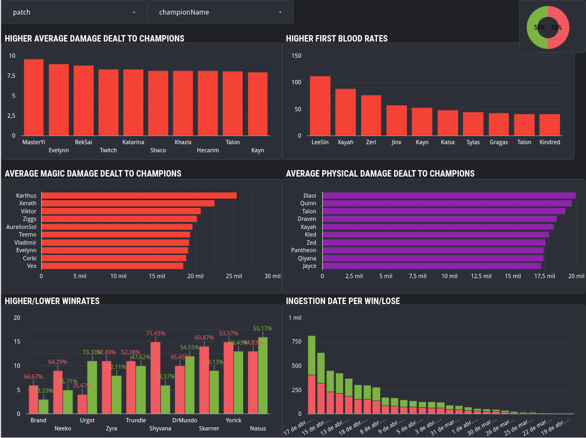

# League of legends chalenger data match pipeline


This project performs a complete pipeline of the match data from the challenging rank of the electronic game league of legends provided by the game's official api and finally an analysis of this data, this analysis seeks to answer questions such as:

* Which characters have the highest and lowest win rate?  
* Which characters deal the most damage per match?
* Which characters deal the highest amounts of physical/magical damage per match?
* Which characters most often apply first blood?

## Project Architecture

## Setup
### Stack

* Iac : Terraform
* Cloud : GCP
* Orchestration: Prefect
* DL: GCS
* DW: BigQuery
* Transformations: dbt


### First steps 

For this project, we'll use a free trial version of google cloud platform. 

1. Create an account with your Google email ID 
2. Setup your first [project](https://console.cloud.google.com/) if you haven't already
3. Setup [service account & authentication](https://cloud.google.com/docs/authentication/getting-started) for this project
    * Grant `Viewer` role to begin with.
    * Download service-account-keys (.json) for auth.
4. Download [SDK](https://cloud.google.com/sdk/docs/quickstart) for local setup
5. Set environment variable to point to your downloaded GCP keys:
   ```shell
   export GOOGLE_APPLICATION_CREDENTIALS="<path/to/your/service-account-authkeys>.json"
   # Refresh token/session, and verify authentication
   gcloud auth application-default login
   ```
   
### Setup for Access
 
1. [IAM Roles](https://cloud.google.com/storage/docs/access-control/iam-roles) for Service account:
   * Go to the *IAM* section of *IAM & Admin* https://console.cloud.google.com/iam-admin/iam
   * Click the *Edit principal* icon for your service account.
   * Add these roles in addition to *Viewer* : **Storage Admin** + **Storage Object Admin** + **BigQuery Admin**
   
2. Enable these APIs for your project:
   * https://console.cloud.google.com/apis/library/iam.googleapis.com
   * https://console.cloud.google.com/apis/library/iamcredentials.googleapis.com
   
3. Please ensure `GOOGLE_APPLICATION_CREDENTIALS` env-var is set.
   ```shell
   export GOOGLE_APPLICATION_CREDENTIALS="<path/to/your/service-account-authkeys>.json"
   ```


### 1. Startup cloud services

Access the './terraform' directory and run the below commands, this commandas will start Google cloud storage and Bigquery services nedeed to pipeline works.
 #### Pre-Requisites
1. Terraform client installation: https://www.terraform.io/downloads
### Execution

```shell
# Refresh service-account's auth-token for this session
gcloud auth application-default login

# Initialize state file (.tfstate)
terraform init

# Check changes to new infra plan
terraform plan -var="project=<your-gcp-project-id>"
```

```shell
# Create new infra
terraform apply -var="project=<your-gcp-project-id>"
```

```shell
# Delete infra after your work, to avoid costs on any running services
terraform destroy
```

### 2. Requirements

Install python libs to run scripts correctly.

```shell
# This command nedeed be run on ./
pip install -r requirements.txt
```

### 3. Scripts orchestration

To do this we use Prefect, run below commands:
```shell
# Start the GUI and access on http://127.0.0.1:4200/
prefect orion start
```
```shell
# Start the Prefect agent on default
prefect agent start -q 'default'
```
#### Firs script 01_etl_chalengers_to_gcs.py

This script will use the entries(v4) and summoner(v4) endpoints to capture the 200 players in the currently challenging queue by adding their puuid to the df and writing a csv to the data lake(gcs). 

#### Second script 02_etl_match_ids_to_gcs.py

This script reads the last csv written by script one based on each puuid captures the match_ids of the players' matches using the match(v5) endpoint, with this a new csv is written only with the match ids in a second layer of the data lake( gcs).


#### Third script 03_etl_data_match_to_bq.py

This script uses the match(v5) endpoint to capture the data of the matches using the csv written by the second script with the match_ids listing, in this way we obtain a dataframe that is composed of each line being a player, that is, 10 lines for each match. After all the df assembly process it is written in bigquery as a table.

#### Deploy scripts
```shell
# Realize the first script deploy with schedule for 01:00 AM for UTC -3
prefect deployment build 01_etl_chalengers_to_gcs.py:etl_chalengers_to_gcs --name 01_chalengers_to_gcs --cron '0 1 * * *' --timezone 'America/Sao_Paulo' -a
```
```shell
# Realize the second deploy with schedule for 01:30 AM for UTC -3
prefect deployment build 02_etl_match_ids_to_gcs.py:etl_match_ids_to_gcs_subflow --name 02_match_ids_to_gcs --cron '30 1 * * *' --timezone 'America/Sao_Paulo' -a
```
```shell
# Realize the thirty deploy with schedule for 03:00 AM for UTC -3
prefect deployment build 03_etl_data_match_to_bq.py:etl_data_match_to_bq_subflow --name 03_data_match_to_bq --cron '0 3 * * *' --timezone 'America/Sao_Paulo' -a
```
These scripts will be run every day below the chalenger queue resets, assim capturando as partidas dos novos jogadores que entraram no chalenger.

### 4. dbt/bigquery transformations
After step three, the data flow will generate a table called 'match_data_raw' in the bigquery, from which we will carry out transformations with the dbt and later partitioning and clustering it with the bigquery.
 #### dbt
The dbt project repository can be found at './dbt' or access it by clicking [here](./dbt/).
 Four models were used for transformations with dbt:
 * stg_data_match: Performs transformations on data types, except timestamps.
 * prep_data_match: Performs transformations in data types, only in timestamps.
 * row_numbers: Performs a row_numbers() to identify duplicate records.
 * refine_data_match: Adds a 'delete_case' column that takes no for the first record partitioned by the row_numbers() model and 'yes' for the rest

#### bigquery
At this moment we have a table called "refine_data_match" with the duplicate data flagged and with the correct typings. From there we will partition and cluster the data by performing some filters.
Run the script present in the path './big_query/partitioning_and_clustering.sql' in bigquery, where we will partition the table by the date of creation of the matches and cluster by the name of the characters, in this way we will optimize the queries carried out in order to filter the champions played in a certain period.
```shell
CREATE OR REPLACE TABLE `lol-data-project-383712.lol.match_data_clean`
PARTITION BY DATE(gameCreation)
CLUSTER BY championName AS
SELECT * FROM `lol-data-project-383712.dbt_lol_project.refine_data_match` WHERE delete_case = 'nao' AND game_mode = 'CLASSIC';
```
### 5. Data visualization with google data studio
In this step you need to connect your table in bigquery with your google data studio account(tutorial [here](https://support.google.com/looker-studio/answer/6295968?hl=en#zippy=%2Cin-this-article)).
Done this, you can elaborate a dashboard with data.



